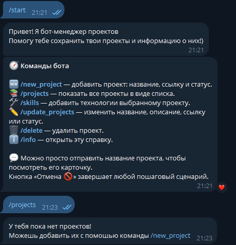

# Portfolio Bot

Это мой Telegram-бот для хранения проектов. Я сделал его на Python и SQLite, чтобы можно было добавлять проекты, менять их данные и быстро смотреть список.

## Как выглядит бот



## Что умеет бот

- добавлять проекты с описанием, ссылкой и статусом;
- показывать все сохранённые проекты;
- показывать подробную информацию о выбранном проекте;
- добавлять навыки к проектам;
- менять данные проекта;
- удалять проекты;
- отменять незавершённые действия кнопкой `Отмена 🚫`.

## Команды

- `/start` — запустить бота;
- `/info` — посмотреть подсказку;
- `/new_project` — добавить проект;
- `/projects` — посмотреть проекты;
- `/skills` — добавить навык проекту;
- `/update_projects` — изменить проект;
- `/delete` — удалить проект.

Ещё можно просто отправить название проекта, чтобы открыть его карточку.

## Запуск

1. Установить библиотеку для Telegram-бота:

```text
pip install pyTelegramBotAPI
```

1. Вставить токен бота в `config.py`:

```python
TOKEN = "сюда_токен_бота"
```

1. Заполнить базу начальными проектами:

```text
python logic.py
```

1. Запустить бота:

```text
python main.py
```

Проекты сохраняются в локальной базе `portfolio.db`.

## Файлы проекта

- `main.py` — команды и логика Telegram-бота;
- `logic.py` — работа с базой данных и список проектов;
- `config.py` — настройки и токен бота;
- `portfolio.db` — база данных SQLite.

Проект сделан для практики Python, SQLite и работы с GitHub.
